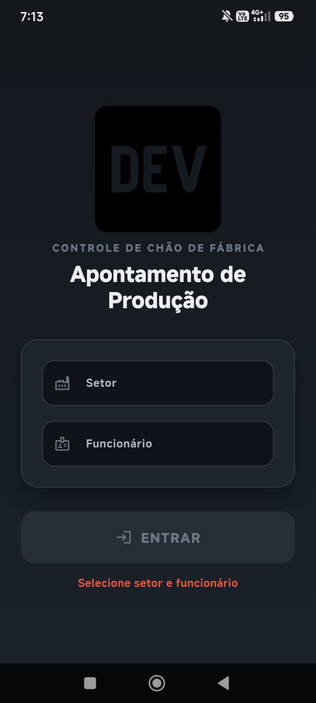
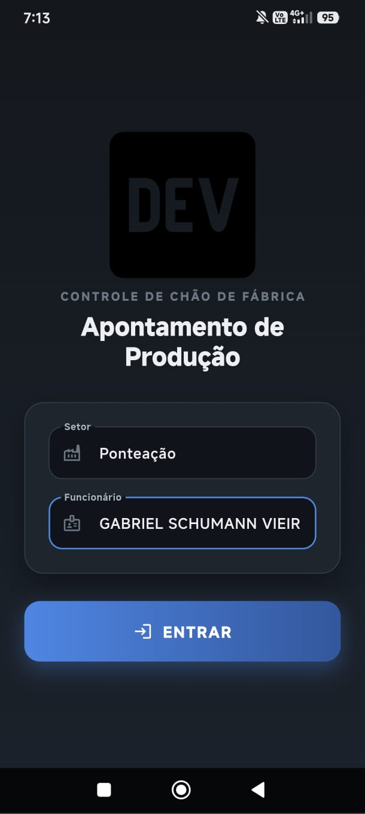
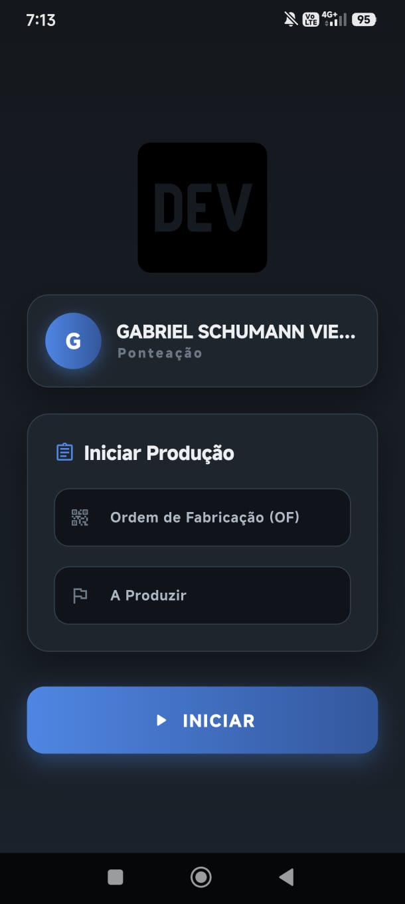
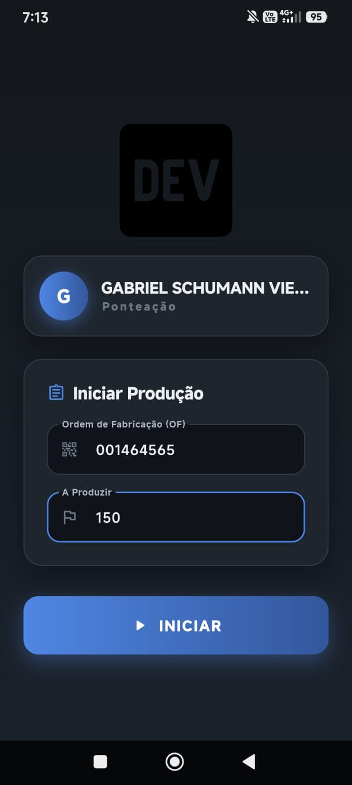
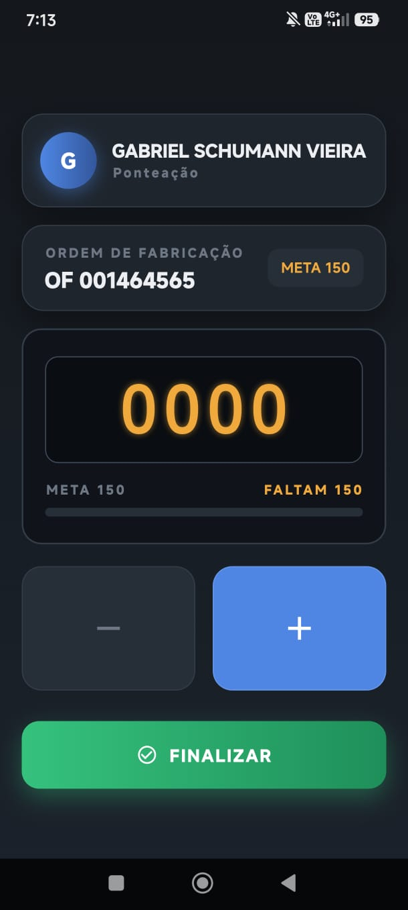
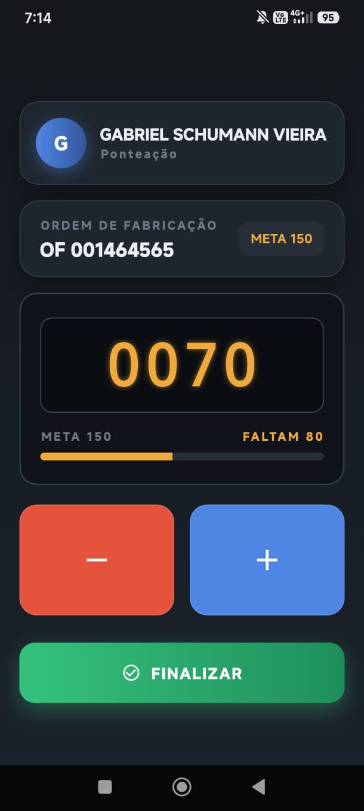
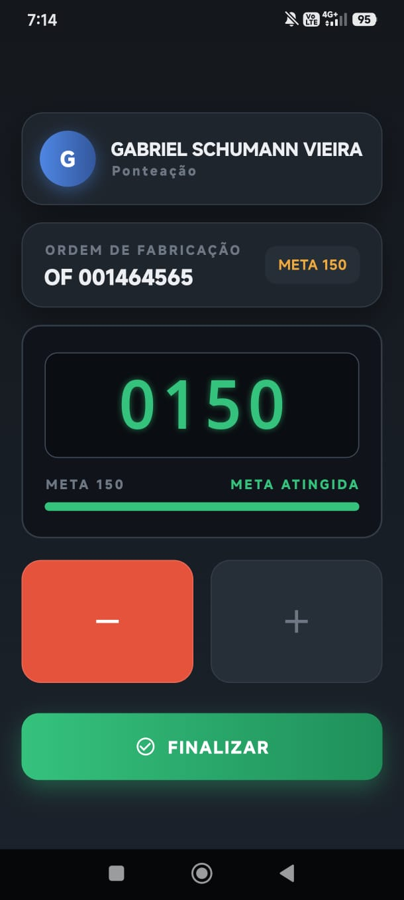
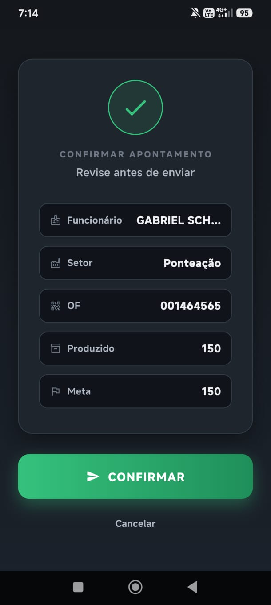

# App Apontamento

Sistema de apontamento de produção industrial desenvolvido em Flutter, com backend em Firebase (Firestore).

## Sobre o projeto

Aplicativo para controle de chão de fábrica, permitindo que operadores registrem o apontamento de produção por setor, ordem de fabricação (OF) e quantidade produzida em tempo real.

## Funcionalidades

- Seleção de setor e operador
- Abertura de ordem de fabricação (OF) com meta de produção
- Contador de produção em tempo real, sincronizado com o Firestore
- Finalização de apontamento com confirmação
- Suporte a operação offline com fila de sincronização

## Screenshots

### 1. Login
Seleção de setor e funcionário para entrar no sistema.

 

### 2. Iniciar Produção
Abertura da Ordem de Fabricação (OF) com definição da meta.

 

### 3. Apontamento em tempo real
Contador de produção com indicador de progresso até a meta ser atingida.

  

### 4. Confirmação
Revisão dos dados antes de finalizar o apontamento.



## Tecnologias

- Flutter
- Firebase (Cloud Firestore, Firebase Auth)
- Dart

## Estrutura do projeto

```text
lib/
  main.dart
  models/
    apontamento.dart
  screens/
    home_screen.dart
    order_input_screen.dart
    order_screen.dart
    production_screen.dart
    confirm_screen.dart
  services/
    api_service.dart
    connectivity_service.dart
    offline_queue_service.dart
  theme/
    app_theme.dart
    widgets.dart
  widgets/
    quantity_selector.dart
```

## Configuração

Este repositório não inclui as credenciais do Firebase (firebase_options.dart, google-services.json, firestore.rules, etc.), por questões de segurança.

Para rodar o projeto localmente:

1. Crie um projeto no [Firebase Console](https://console.firebase.google.com/)
2. Instale o FlutterFire CLI e gere seu próprio arquivo de configuração:

```bash
flutterfire configure
```

3. Configure as regras do Firestore de acordo com sua necessidade
4. Rode o projeto:

```bash
flutter pub get
flutter run
```

## Status

Projeto em desenvolvimento ativo.